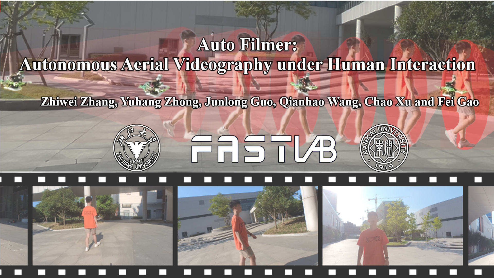
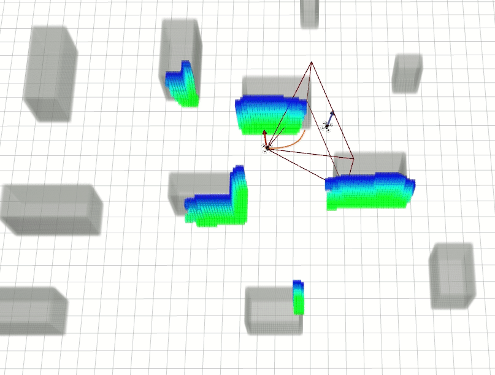
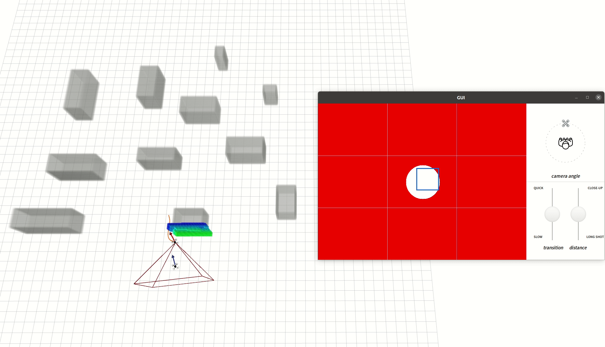

# Auto-Filmer
A Videography Planner for Quadrotors with a Rotating Gimbal.

<a href="https://www.youtube.com/watch?v=Lrk9MVJEMpo" target="blank">
  <p align="center">
    
  </p>
</a>

**Video Links**: [youtube](https://www.youtube.com/watch?v=Lrk9MVJEMpo) or [bilibili](https://www.bilibili.com/video/BV14S4y1W7tL)

## 0. Overview
**Auto-Filmer** is a planner for autonomous tracking and videogrphy in unknown circumstance. It enables users to send shooting command in real-time while keeping the drone safe.

**Authors**: Zhiwei Zhang (real_zhiwei@zju.edu.cn) and [Fei Gao](https://ustfei.com/) from the [ZJU Fast Lab](http://zju-fast.com/). 

**Paper**: [Auto Filmer: Autonomous Aerial Videography Under Human Interaction](https://ieeexplore.ieee.org/document/9998054), Zhiwei Zhang, Yuhang Zhong, Junlong Guo, Qianhao Wang, Chao Xu and Fei Gao, Published in IEEE Robotics and Automation Letters (RAL).

<p align="center">
    
</p>
<p align="center">
    
</p>

## 1. Setup

### 1.1. Download

```
git clone https://github.com/ZJU-FAST-Lab/Auto-Filmer.git
cd Auto-Filmer
```
### 1.2 Depth Render
We use CUDA to render depth. Please remember to also change the 'arch' and 'code' flags in the line of 

```
  set(CUDA_NVCC_FLAGS 
      # set this according to your cuda version
      -gencode=arch=compute_80,code=sm_80 ;
  ) 
``` 
in _CMakeList.txt_ in the package __local_sensing__. If you encounter compiling error due to different Nvidia graphics card you use or you can not see proper depth images as expected, you can check the right code via [link1](https://arnon.dk/matching-sm-architectures-arch-and-gencode-for-various-nvidia-cards/) or [link2](https://github.com/tpruvot/ccminer/wiki/Compatibility).

### 1.3 Graphical User Interface

The Python package [tkinter](https://docs.python.org/3/library/tkinter.html) is used to create the videography interface. To install tkinter,
```
pip install tk
```

 
### 1.4. Compilation

```
catkin_make
source devel/setup.sh
```

## 2. Run & Interation

```
roslaunch planning af_tracking.launch
```

Use "2D Nav Goal" in Rviz to select goals for the target drone, then the filming drone begins to follow and shoot it.

<p align="center">
    
</p>


Furthermore, our gui provides videography interactions. The gif below shows an image position change (the white circle in the image indicates the target). Try to change other items including the camera angle, transition time and distance by yourself. :smile:
<p align="center">
    
</p>


## 3. Acknowledgement
We use [**MINCO**](https://github.com/ZJU-FAST-Lab/GCOPTER) as our trajectory representation.

We use [**EGO-Planner-v2**](https://github.com/ZJU-FAST-Lab/EGO-Planner-v2) as the target drone planner.

[**Elastic Tracker**](https://github.com/ZJU-FAST-Lab/Elastic-Tracker) provides an efficient framework of tracking objects.

We use [**DecompROS**](https://github.com/sikang/DecompROS) for safe flight corridor generation and visualization.

## 4. Citation
```bibtex
@ARTICLE{9998054,
  author={Zhang, Zhiwei and Zhong, Yuhang and Guo, Junlong and Wang, Qianhao and Xu, Chao and Gao, Fei},
  journal={IEEE Robotics and Automation Letters}, 
  title={Auto Filmer: Autonomous Aerial Videography Under Human Interaction}, 
  year={2023},
  volume={8},
  number={2},
  pages={784-791},
  doi={10.1109/LRA.2022.3231828}}
```

